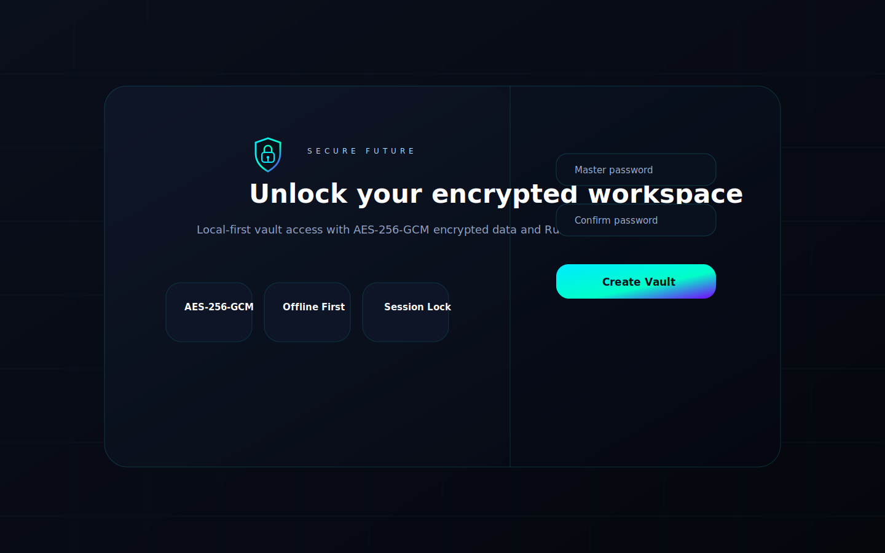
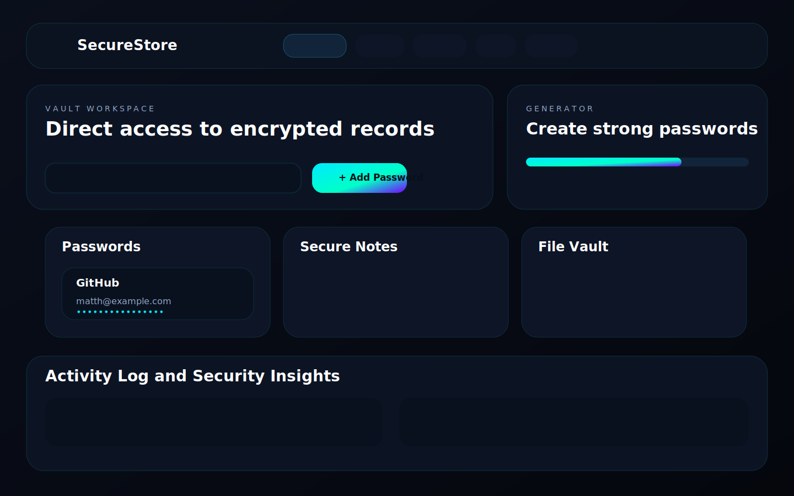
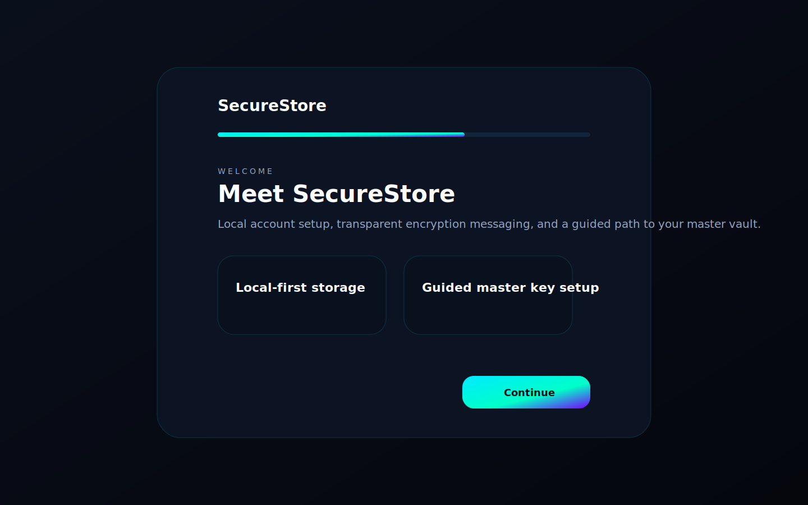

# SecureStore


SecureStore is an offline-first desktop password vault built with Rust, Tauri, React, and Vite. It now includes a backend security engine that evaluates password strength, reuse, compromised-password signatures, session risk, and suspicious authentication activity in real time.

## Repository

Repository name: `SecureStore`

## Product Preview

### Lock Screen



### Vault Dashboard



### Onboarding Flow



## Overview

SecureStore now includes:

- SecureStore branding across the app shell, native window metadata, docs, and assets
- SecureStore+ preview mode on the lock screen with premium branding and future-feature placeholders
- Local account sign-up and login with bcrypt-hashed account passwords
- Guided onboarding before vault creation
- Master-password-protected vault encryption
- Real-time password scanning for weak, reused, and compromised credentials
- Vault-wide security scoring, posture labels, alerts, and security logs
- Login rate limiting, exponential lockout delays, and session expiration tracking
- Clipboard confirmation prompts and adjustable auto-lock behavior
- Auto-detect dev port launchers for Vite and Tauri development

## SecureStore+

SecureStore+ is currently a frontend preview mode. The lock screen includes an `Upgrade to SecureStore+` button beside `Start over`. Activating it stores preview state locally, updates the header to `SecureStore+`, adds a premium badge/glow treatment, and shows locked cards for future features:

- Secure sharing
- Cloud sync
- Advanced encryption tools

No payment system or backend billing has been implemented yet.

## Security Highlights

- Account passwords are hashed with bcrypt and validated against stronger complexity rules
- Vault keys are derived from the master password with Argon2id
- Vault payloads and encrypted files are protected with layered AES-256-GCM and ChaCha20-Poly1305 encryption
- Compromised-password detection uses a k-anonymity-style SHA-1 prefix/suffix lookup against local breach signatures
- Failed login and unlock attempts trigger increasing delays and temporary lockouts
- Session state tracks expiration and idle activity
- Persisted account and vault records use safer atomic writes
- Clipboard prompts never auto-store copied data

## Tech Stack

- Frontend: React, TypeScript, Vite, Tailwind CSS, Framer Motion
- Desktop shell: Tauri
- Backend: Rust
- Storage: Local JSON records plus encrypted file blobs
- Crypto: bcrypt, Argon2id, AES-256-GCM, ChaCha20-Poly1305

## Development Setup

1. Install Node.js, Rust 1.85 or newer, and Tauri prerequisites for your platform.
2. Run `npm install`.
3. Start the web dev server with `npm run dev`.
4. Start the desktop app with `npm run tauri:dev`.
5. Run backend validation with `cargo test -p secure_vault_backend`.

## Containerized Preview

SecureStore includes Docker support for reproducible validation and frontend preview.

```bash
docker build -t securestore:1.0.0 .
docker compose up --build
```

The container builds the frontend, runs backend tests, and serves the Vite preview on `http://localhost:4173`.

Native Tauri desktop packaging should still be performed on the target OS or a CI runner configured for desktop packaging.

## Development Notes

- `npm run dev` auto-selects a free local port.
- `npm run tauri:dev` starts Vite on a free port, generates a temporary Tauri config override, then launches the desktop shell against the matching URL.
- Tauri bundle config now references the project favicon alongside the native `.ico` asset.
- `.gitignore` excludes secrets, local vault data, generated runtime data, build artifacts, `node_modules`, Rust `target`, and local environment files.

## Release

Release name: `SecureStore`

Release tag: `v1.0.0`

See [Release Process](docs/RELEASE.md) for local and GitHub release steps.

## Repository Documents

- [Architecture](docs/ARCHITECTURE.md)
- [Containerization](docs/CONTAINERIZATION.md)
- [Security Notes](docs/SECURITY.md)
- [Encryption Details](docs/ENCRYPTION.md)
- [Data Protection](docs/DATA_PROTECTION.md)
- [Usage Guide](docs/USAGE.md)
- [FAQ](docs/FAQ.md)
- [Contributing](docs/CONTRIBUTING.md)
- [Phase 2 Summary](docs/PHASE2.md)
- [Release Process](docs/RELEASE.md)
- [Changelog](CHANGELOG.md)
- [Security Policy](SECURITY.md)
- [Code of Conduct](CODE_OF_CONDUCT.md)
